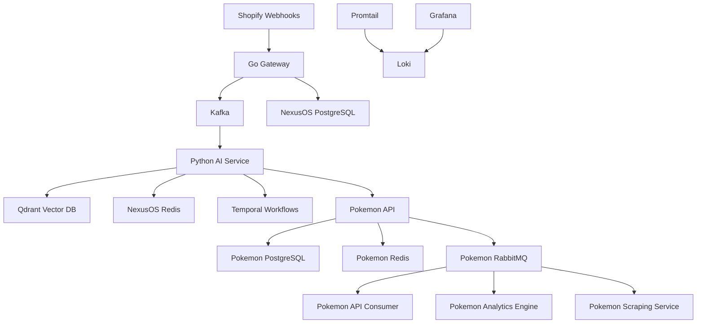

# Develop Expertise

Responsibility:

> Develop expertise in key areas for the Infrastructure team on various areas of the business and the platforms and best practices necessary to improve that area's ability to make critical business decisions.

This file is not another Linux command checklist.

You already have system administration, networking, cybersecurity, scripting, and observability tracks elsewhere in `future_standard_mastery/`. This document is the next layer: learning how to become the infrastructure person who understands a business platform deeply enough to help leaders make better decisions about reliability, security, cost, risk, and technical direction.

For this lab, use the full repo:

```text
/home/iscjmz/shopify/shopify
```

Treat `NexusOS` as the main business platform and `Pokemon/` as a separate market-intelligence microservice that NexusOS depends on for live card data.

## The Real Meaning

This responsibility is about platform judgment.

An amateur says:

```text
The containers are running.
```

An infrastructure engineer says:

```text
The Shopify webhook path depends on the Go gateway, Kafka, PostgreSQL, and the Python AI service.
The fraud, SEO, and approval features can continue if Pokemon is down, but live market pricing and repricing decisions degrade.
The highest business risks are stale market data, unverified AI actions, weak audit trails, missing backup evidence, and unclear recovery objectives.
Before we scale this platform, we need dependency ownership, data freshness checks, restore testing, alert thresholds, and documented change controls.
```

That second answer is what Future Standard is asking for.

They do not only want someone who knows commands.
They want someone who can learn a business area, understand the platform behind it, identify the controls that keep it trustworthy, and explain what needs to improve.

In a finance company, this matters even more because decisions can depend on data being correct, fresh, secure, auditable, and available. If a research platform, reporting pipeline, portfolio tool, or internal workflow gives stale or incomplete data, the business might make a bad decision while believing the system is healthy.

The infrastructure engineer's job is to reduce that gap between "the system appears fine" and "the business can trust this system."

## What You Need To Know First

Before starting the tasks, understand these five ideas.

### Business Capability

A business capability is something the business needs to do.

For NexusOS, examples are:

```text
Receive Shopify webhooks.
Score fraud risk.
Recover abandoned carts.
Generate SEO text.
Negotiate with other AI agents.
Track approvals.
Use Pokemon market data for pricing decisions.
```

For a finance company, similar capabilities might be:

```text
Load market data.
Produce risk reports.
Run portfolio analytics.
Manage employee access.
Retain audit logs.
Support secure remote work.
```

Infrastructure expertise begins when you connect a business capability to the systems that support it.

### Platform

A platform is the collection of services, data stores, queues, workflows, identities, configs, logs, and operational processes that make a capability work.

In this repo, NexusOS is not just "Go plus Python."

It is:

```text
Go gateway
Python AI service
React dashboard
PostgreSQL with pgvector
Redis
Qdrant
Kafka
Zookeeper
Temporal
Ollama
Pokemon microservice
Docker Compose
Migrations
Secrets
Health routes
Logs
Human approval workflows
```

Pokemon is also not just a side folder. It has its own platform:

```text
Go API
React client
PostgreSQL
Redis
RabbitMQ
Python api-consumer
Python analytics-engine
Go scraping-service
Loki
Promtail
Grafana
External market APIs
```

Your job is to see the full operating system of the product, not only the application code.

### Critical Decision

A critical decision is a business choice that depends on the platform's output.

In this repo:

```text
Should the merchant refund this customer?
Should the merchant restock this product?
Should an AI agent be allowed to negotiate a purchase?
Should a Pokemon card price be changed?
Should a fraud warning block fulfillment?
Should a stale market signal be trusted?
```

In a finance company:

```text
Should a portfolio manager trust this risk report?
Should a data team trust today's market feed?
Should a compliance team trust the audit trail?
Should IT approve access to sensitive data?
Should the firm accept downtime during a maintenance window?
```

Infrastructure supports these decisions by making the platform reliable, observable, recoverable, and controlled.

### Control

A control is a practice that reduces risk.

Examples:

```text
Healthchecks reduce silent failure.
Backups reduce data loss.
Least privilege reduces blast radius.
Approval queues reduce unauthorized AI action risk.
Audit logs reduce investigation uncertainty.
Change control reduces accidental production breakage.
Runbooks reduce incident confusion.
Monitoring reduces time to detection.
Restore tests prove backups are real.
```

Finance companies care about controls because they need evidence. It is not enough to say "we probably have logs." You need to know where logs live, what they contain, how long they last, and whether they prove what happened.

### Decision Evidence

Decision evidence is the proof an infrastructure engineer gives to support a recommendation.

Weak evidence:

```text
I think Postgres is important.
```

Strong evidence:

```text
Postgres is the source of truth for orders, approvals, customers, inventory, and agent actions.
The Go gateway connects to it on startup and runs migrations.
The Python AI service uses persisted records for workflows and approvals.
If Postgres is unavailable, fraud scoring may still compute transiently, but persistence, approvals, audit history, and tenant data access degrade or fail.
Current backup evidence is not documented, so the platform has unknown recovery confidence.
Recommendation: define RPO/RTO, add scheduled backups, and perform a restore drill.
```

This is the level you are training for.

## What This File Will Not Repeat

These tasks intentionally avoid repeating the basic labs you already have.

You already have work for:

```text
Linux host inspection
Docker process checks
Port scanning
Simple service health checks
Runtime dependency auditing
Basic database reporting
Basic queue/service scripts
General security scanning
```

This file builds on that work. You will still use commands and code, but the output is different. The output is decision material: maps, memos, ratings, controls, evidence, and recommendations.

## Work Product Standard

Every task in this document must end with an artifact.

Do not finish a task with "I read the files."

Finish with something another engineer could use:

```text
A Markdown decision memo.
A Mermaid dependency map.
A criticality matrix.
A control gap report.
A data freshness script.
A business impact summary.
A change proposal.
A restore drill record.
An incident review.
```

Write like you are leaving evidence for a future teammate.

## Task 1: Build The Business Capability Map

### What You Are Learning

You are learning to stop thinking in folders and start thinking in business capabilities.

The folder tree tells you where code lives. The business capability map tells you what the company can actually do because that code exists.

This is one of the most important infrastructure skills because platform work is only valuable when it supports a real business function. A finance company does not care that "Kafka is running" by itself. It cares that trade events, audit events, market data, risk calculations, and downstream reports keep flowing.

For NexusOS, the business capabilities are things like fraud scoring, cart recovery, SEO generation, agent negotiation, approvals, inventory forecasting, and market-pricing enrichment from Pokemon.

For Pokemon, the business capabilities are market ingestion, trend detection, inventory tracking, alerts, show discovery, and observability.

### What To Inspect

Read these files:

```bash
sed -n '1,220p' /home/iscjmz/shopify/shopify/README.md
sed -n '1,220p' /home/iscjmz/shopify/shopify/docker-compose.yml
sed -n '1,220p' /home/iscjmz/shopify/shopify/Pokemon/docker-compose.yml
find /home/iscjmz/shopify/shopify/services -maxdepth 3 -type f | sort
find /home/iscjmz/shopify/shopify/Pokemon/services -maxdepth 3 -type f | sort
```

### What To Create

Create:

```text
/home/iscjmz/shopify/shopify/future_standard_mastery/artifacts/business-capability-map.md
```

Use this template:

```markdown
# Business Capability Map

## Purpose

This document maps business capabilities to the technical platform components that support them.
The goal is to make infrastructure decisions based on business impact, not just service names.

## Capability: Shopify Webhook Ingestion

Business value:
Shopify events enter NexusOS so the platform can react to orders, products, inventory, refunds, and customers.

Critical decision supported:
Can the system trust that Shopify events were received, verified, and published for downstream processing?

Primary services:
- Go gateway
- Kafka
- PostgreSQL

Data involved:
- Shopify webhook payloads
- merchant records
- event metadata
- idempotency data

Failure mode:
If the gateway fails, events do not enter the system.
If Kafka fails, events may be received but not distributed reliably.
If PostgreSQL fails, persistence and migrations may break.

Infrastructure controls needed:
- HMAC verification
- idempotency
- Kafka health monitoring
- gateway healthcheck
- database backup and restore testing
- webhook failure logs

Decision confidence:
Medium until event replay, alerting, and retention are documented.
```

Add sections for at least these capabilities:

```text
Shopify webhook ingestion
Fraud scoring
Cart recovery
SEO generation
Approval workflow
AI agent negotiation
Pokemon market data enrichment
Pokemon trend analytics
Pokemon alerting
Observability
```

### How You Know You Did It Right

You did this right when you can point to any business capability and explain:

```text
what it does
why it matters
which services support it
which data it depends on
what breaks first
which controls are missing
what a business stakeholder should know
```

## Task 2: Create The Cross-Platform Dependency Map

### What You Are Learning

You are learning dependency reasoning across platform boundaries.

This matters because Future Standard may have systems that look separate but are operationally connected. A reporting system may depend on a data lake. A data lake may depend on SSO. SSO may depend on networking. A trading dashboard may depend on a market data vendor. A compliance export may depend on logs from multiple platforms.

Your repo already has this pattern: NexusOS is the main platform, but it depends on Pokemon for live card market intelligence.

### What To Inspect

Read:

```bash
sed -n '1,220p' /home/iscjmz/shopify/shopify/services/gateway/internal/pokemon/client.go
sed -n '1,220p' /home/iscjmz/shopify/shopify/services/ai/integrations/pokemon_client.py
sed -n '1,220p' /home/iscjmz/shopify/shopify/docker-compose.yml
sed -n '1,220p' /home/iscjmz/shopify/shopify/Pokemon/docker-compose.yml
```

### What To Create

Create:

```text
/home/iscjmz/shopify/shopify/future_standard_mastery/artifacts/cross-platform-dependency-map.md
```

Use Mermaid so the dependency map is executable documentation:

````markdown
# Cross-Platform Dependency Map

## Why This Exists

This map shows how NexusOS and Pokemon depend on each other.
The goal is to understand failure impact before an incident happens.



## Critical Paths

Critical path 1:
Shopify webhook -> Go gateway -> Kafka -> Python AI service -> approval workflow.

Critical path 2:
Python AI service -> Pokemon API -> Pokemon Postgres -> market price data.

Critical path 3:
Pokemon api-consumer -> RabbitMQ -> Postgres -> analytics-engine -> trend output.

## Degradation Rules

If Pokemon is down:
NexusOS should still support fraud, SEO, and basic approvals, but market-aware pricing and repricing decisions should degrade.

If NexusOS Kafka is down:
Webhook ingestion and downstream AI workflows are at risk.

If Pokemon RabbitMQ is down:
Market ingestion and async processing are at risk.
````

### How You Know You Did It Right

You did this right when the map lets you answer:

```text
If Pokemon goes down, what still works in NexusOS?
If Kafka goes down, which decisions lose event flow?
If RabbitMQ goes down, which Pokemon features become stale?
If Qdrant goes down, which AI features lose memory or retrieval?
If Temporal goes down, which long-running workflows are at risk?
```

## Task 3: Build The Critical Decision Register

### What You Are Learning

You are learning to identify where infrastructure affects decisions.

This is the heart of the responsibility. Future Standard is not asking you to memorize every platform. They are asking you to develop expertise in the areas that help the business make critical decisions.

So you need a register of important decisions and the technical evidence behind them.

### What To Create

Create:

```text
/home/iscjmz/shopify/shopify/future_standard_mastery/artifacts/critical-decision-register.md
```

Use this format:

```markdown
# Critical Decision Register

## Decision: Should an order be marked high fraud risk?

Business owner:
Merchant operations / risk workflow.

System owner:
NexusOS AI service and Go gateway.

Inputs:
- Shopify order webhook
- customer data
- order history
- fraud scoring route
- model output

Infrastructure dependencies:
- Go gateway
- Kafka
- Python AI service
- PostgreSQL
- Redis if idempotency or cache is used

Failure risks:
- webhook not received
- duplicate webhook processed
- AI service unavailable
- model produces output without audit trail
- database unavailable for persistence

Controls needed:
- webhook HMAC verification
- idempotency keys
- request logs
- fraud score persistence
- approval queue for high-risk actions
- alert when fraud route fails

Decision confidence:
Medium.

Reason:
The platform has route structure and gateway verification, but evidence for alerting, replay, and persisted audit trail must be confirmed.

Recommendation:
Add a fraud decision audit record that stores input summary, model used, score, decision, timestamp, and approval status.
```

Add at least eight decisions:

```text
Should an order be marked high fraud risk?
Should an AI-generated refund action require human approval?
Should a cart recovery email be sent?
Should an SEO bulk generation job be trusted?
Should a Pokemon price trend influence repricing?
Should stale Pokemon market data block a recommendation?
Should a merchant approval be executed?
Should a customer delete request trigger data deletion?
```

### Finance-Company Angle

In a finance company, this same artifact becomes:

```text
Should a risk report be trusted?
Should a data feed be considered stale?
Should an access request be approved?
Should a model-generated recommendation be used?
Should a compliance export be accepted?
```

The skill is identical. You map the decision to systems, data, failure modes, controls, and evidence.

## Task 4: Create A Data Freshness And Trust Model

### What You Are Learning

Finance companies care deeply about data freshness.

Bad data is not only missing data. Bad data can also be old data, partial data, duplicated data, unaudited data, or data from a failed upstream job that no one noticed.

In this repo, Pokemon market data is exactly the kind of thing that can silently become stale. The frontend might still load. The API might still return a response. But if the market data is old, the business decision is weak.

### What To Build

Create:

```text
/home/iscjmz/shopify/shopify/Pokemon/scripts/data_freshness_report.py
```

Start with this code and comment it heavily as you work:

```python
#!/usr/bin/env python3
"""
data_freshness_report.py

This script answers one business question:

Can we trust the freshness of Pokemon market data right now?

Infrastructure reason:
A service can be running while its data is stale.
Finance and investment platforms care about this because stale data can lead to bad decisions.
"""

from __future__ import annotations

import os
import sys
from dataclasses import dataclass
from datetime import datetime, timezone

import psycopg2
import psycopg2.extras
from dotenv import load_dotenv


PROJECT_ROOT = os.path.abspath(os.path.join(os.path.dirname(__file__), ".."))
ENV_FILE = os.path.join(PROJECT_ROOT, ".env")


@dataclass
class FreshnessCheck:
    table: str
    timestamp_column: str
    max_age_minutes: int
    newest_seen: str | None
    age_minutes: float | None
    status: str
    business_risk: str


def load_environment() -> None:
    """Load database settings from Pokemon/.env."""
    load_dotenv(ENV_FILE)


def connect_db():
    """Connect to Pokemon PostgreSQL using environment variables."""
    url = (
        f"postgres://{os.getenv('POSTGRES_USER', 'pokemontool_user')}:"
        f"{os.getenv('POSTGRES_PASSWORD', 'pokemontool_pass')}@"
        f"{os.getenv('POSTGRES_HOST', 'localhost')}:"
        f"{os.getenv('POSTGRES_PORT', '5432')}/"
        f"{os.getenv('POSTGRES_DB', 'pokemontool')}"
    )
    return psycopg2.connect(url, cursor_factory=psycopg2.extras.RealDictCursor)


def table_exists(conn, table: str) -> bool:
    """Return True when the target table exists in the public schema."""
    with conn.cursor() as cur:
        cur.execute(
            """
            SELECT EXISTS (
                SELECT 1
                FROM information_schema.tables
                WHERE table_schema = 'public'
                  AND table_name = %s
            ) AS exists
            """,
            (table,),
        )
        return bool(cur.fetchone()["exists"])


def newest_timestamp(conn, table: str, column: str):
    """Return the newest timestamp in a table, or None if no rows exist."""
    with conn.cursor() as cur:
        cur.execute(f"SELECT MAX({column}) AS newest_seen FROM {table}")
        return cur.fetchone()["newest_seen"]


def check_freshness(conn, table: str, column: str, max_age_minutes: int, business_risk: str) -> FreshnessCheck:
    """Check whether a table has recent enough data for business use."""
    if not table_exists(conn, table):
        return FreshnessCheck(table, column, max_age_minutes, None, None, "missing_table", business_risk)

    newest = newest_timestamp(conn, table, column)

    if newest is None:
        return FreshnessCheck(table, column, max_age_minutes, None, None, "no_data", business_risk)

    now = datetime.now(timezone.utc)

    if newest.tzinfo is None:
        newest = newest.replace(tzinfo=timezone.utc)

    age_minutes = (now - newest).total_seconds() / 60
    status = "fresh" if age_minutes <= max_age_minutes else "stale"

    return FreshnessCheck(
        table=table,
        timestamp_column=column,
        max_age_minutes=max_age_minutes,
        newest_seen=newest.isoformat(),
        age_minutes=round(age_minutes, 2),
        status=status,
        business_risk=business_risk,
    )


def main() -> int:
    load_environment()

    checks_to_run = [
        ("price_history", "created_at", 60, "Pricing and trend decisions may use stale market data."),
        ("card_listings", "created_at", 60, "Deal detection may miss current market opportunities."),
        ("alerts", "created_at", 1440, "User alerting may be inactive or unproven."),
    ]

    try:
        conn = connect_db()
    except Exception as exc:
        print(f"Cannot connect to database: {exc}", file=sys.stderr)
        return 1

    try:
        results = [
            check_freshness(conn, table, column, max_age, risk)
            for table, column, max_age, risk in checks_to_run
        ]
    finally:
        conn.close()

    print("Pokemon data freshness report")
    print()

    for result in results:
        print(f"{result.table}.{result.timestamp_column}")
        print(f"  status: {result.status}")
        print(f"  newest_seen: {result.newest_seen}")
        print(f"  age_minutes: {result.age_minutes}")
        print(f"  max_age_minutes: {result.max_age_minutes}")
        print(f"  business_risk: {result.business_risk}")
        print()

    if any(result.status in {"stale", "missing_table", "no_data"} for result in results):
        return 2

    return 0


if __name__ == "__main__":
    raise SystemExit(main())
```

### What To Write After Running It

Create:

```text
/home/iscjmz/shopify/shopify/future_standard_mastery/artifacts/data-freshness-and-trust.md
```

Explain:

```text
Which tables represent decision data?
What freshness threshold makes sense?
What happens if data is stale?
Should stale data block AI recommendations?
Should stale data only warn the user?
What alert would catch this?
```

### Why This Is High Value

This is much more advanced than checking whether a service is running.

You are proving whether the platform's data can support a decision.

That is exactly what infrastructure teams in finance care about.

## Task 5: Build A Control Matrix

### What You Are Learning

You are learning to think like a controlled infrastructure environment.

Future Standard mentions best practices, cybersecurity, access controls, secure configuration, and decision-making. In finance, these become controls: documented ways to prevent, detect, or recover from risk.

### What To Create

Create:

```text
/home/iscjmz/shopify/shopify/future_standard_mastery/artifacts/control-matrix.md
```

Use this structure:

```markdown
# Control Matrix

## Control: Human approval for high-impact AI actions

Risk reduced:
AI agents may take actions that affect money, customers, inventory, or reputation without proper human review.

Where it appears in repo:
- services/ai/agents/crew.py
- services/gateway/internal/db/migrations
- apps/web/src/pages/Approvals.tsx

Evidence to collect:
- approval queue schema
- route that lists pending approvals
- route that approves/rejects actions
- logs showing who approved and when

Current confidence:
Medium.

Reason:
The architecture describes approval workflow, but database persistence and full execution path must be verified.

Improvement:
Add an append-only approval audit table with actor, timestamp, action, payload hash, decision, and reason.
```

Add controls for:

```text
Webhook authenticity
Idempotency
Human approval for AI actions
Tenant isolation / row-level security
Secrets handling
Database backups
Restore testing
Data freshness
Healthchecks
Centralized logging
Alerting
Change control
Least privilege
Customer deletion / GDPR-style deletion
```

### Finance-Company Angle

This prepares you for conversations like:

```text
How do we know only authorized users accessed sensitive data?
How do we prove a critical report used fresh data?
How do we know an automated workflow did not act without approval?
How do we restore data after corruption?
How do we investigate what happened last Thursday at 2:13 PM?
```

## Task 6: Write A Platform Criticality Rating

### What You Are Learning

You are learning prioritization.

Infrastructure teams cannot fix everything at once. Criticality tells the team what matters first.

A finance company especially needs this because some systems are convenience tools, some are productivity tools, and some are business-critical decision platforms.

### What To Create

Create:

```text
/home/iscjmz/shopify/shopify/future_standard_mastery/artifacts/platform-criticality-rating.md
```

Use these tiers:

```text
Tier 0: Business-critical. If down or wrong, important decisions stop or become unsafe.
Tier 1: Major capability degraded. Business can continue, but core workflows suffer.
Tier 2: Useful feature degraded. Users can work around it temporarily.
Tier 3: Support/visibility layer. App may run, but operations become harder.
```

Rate these NexusOS services:

```text
Go gateway
Python AI service
PostgreSQL
Redis
Kafka
Zookeeper
Qdrant
Temporal
Ollama
React dashboard
Pokemon integration
```

Rate these Pokemon services:

```text
Pokemon server
Pokemon Postgres
Pokemon Redis
Pokemon RabbitMQ
api-consumer
analytics-engine
scraping-service
client
Loki
Promtail
Grafana
```

For each service, write:

```text
Tier:
Why:
Business impact:
Recovery expectation:
Monitoring needed:
Owner notes:
```

### Example

```markdown
## Service: NexusOS PostgreSQL

Tier:
Tier 0.

Why:
It stores core relational data, migrations, merchant records, approval state, and audit-relevant records.

Business impact:
If unavailable, the platform may lose persistence, approval tracking, tenant data access, and reliable decision history.

Recovery expectation:
Needs a defined RPO and RTO. Backups must be tested, not assumed.

Monitoring needed:
Connection availability, disk usage, replication or backup status, slow queries, failed migrations.

Owner notes:
This should be treated as a source-of-truth system.
```

## Task 7: Create A Decision Memo For One Improvement

### What You Are Learning

You are learning to recommend work like an engineer, not like a student.

Companies do not only need "here are issues." They need:

```text
What should we do?
Why now?
What risk does it reduce?
What will it cost?
How do we validate it?
How do we roll it back?
```

### What To Create

Create:

```text
/home/iscjmz/shopify/shopify/future_standard_mastery/artifacts/decision-memo-data-freshness.md
```

Use this template:

```markdown
# Decision Memo: Add Data Freshness Gates For Pokemon Market Data

## Recommendation

Add a data freshness check that marks Pokemon market data as stale when price or listing data has not updated within the approved threshold.

## Business Problem

NexusOS may use Pokemon market data to support pricing, repricing, and recommendation workflows.
If that data is old, the system can still appear healthy while producing weak recommendations.

## Current Evidence

Evidence collected:
- Pokemon has api-consumer and analytics-engine services.
- Pokemon stores market-related data in PostgreSQL.
- NexusOS has Pokemon integration clients.
- Runtime checks show whether services run, but not whether business data is fresh.

## Risk

The business may make pricing or inventory decisions using stale data.
In a finance-style environment, this is similar to using stale market data in a risk report.

## Options Considered

Option 1:
Only alert when the api-consumer container is down.

Why insufficient:
The container can be running while ingestion is stuck.

Option 2:
Check the newest timestamp in market-data tables.

Why better:
It measures the actual business signal, not just process existence.

## Proposed Implementation

Create a Python freshness report that checks newest timestamps in decision-data tables.
Expose the result as a report first.
Later, wire it into alerting and possibly API responses.

## Validation

The report should fail when data is missing, stale, or table structure is absent.
The report should pass when the newest data is within the threshold.

## Rollback

Because this starts as a read-only script, rollback is deleting or disabling the script.

## Decision

Approve the read-only data freshness report as the first control.
```

### Why This Is High Value

This teaches the exact muscle Future Standard wants: build expertise, connect it to business risk, recommend a best-practice improvement, and support the decision with evidence.

## Task 8: Build A Change Control Packet

### What You Are Learning

You are learning how infrastructure changes get made safely.

Change control does not mean bureaucracy for its own sake. It means the team knows what is changing, why, how to validate it, and how to undo it.

In finance, uncontrolled changes are dangerous because they can affect reporting, access, audit trails, trading support systems, and security controls.

### What To Create

Create:

```text
/home/iscjmz/shopify/shopify/future_standard_mastery/artifacts/change-control-packet.md
```

Use this scenario:

```text
Change:
Move the Pokemon runtime audit report from /tmp into the repo's scripts/logs folder.

Reason:
/tmp is hard to discover from the project and may be cleaned by the OS.
Repo-local logs are easier for a developer to inspect during local training.

Risk:
If committed accidentally, runtime reports may contain environment details.

Controls:
Write report under scripts/logs.
Ensure logs folder is gitignored if needed.
Avoid secrets in reports.
Document how to regenerate.

Validation:
Run the auditor.
Confirm the report appears under scripts/logs.
Confirm no secrets are included.
Confirm git status does not show generated logs if they should be ignored.

Rollback:
Change OUTPUT_FILE back to /tmp/pokemon_runtime_audit.json.
```

Then actually inspect:

```bash
git -C /home/iscjmz/shopify/shopify/Pokemon status --short
sed -n '1,120p' /home/iscjmz/shopify/shopify/Pokemon/.gitignore
```

Do not change the code yet unless you intentionally decide the change is worth it. The point of this task is to practice controlled decision-making before touching infrastructure behavior.

## Task 9: Build An Executive Platform Brief

### What You Are Learning

You are learning to explain infrastructure to non-infrastructure people.

This matters because the responsibility explicitly says you work with Global Engineering and the Business. The business does not need every container detail. It needs to know what the platform does, what decisions it supports, what risks exist, and what improvements are worth funding.

### What To Create

Create:

```text
/home/iscjmz/shopify/shopify/future_standard_mastery/artifacts/executive-platform-brief.md
```

Use this structure:

```markdown
# Executive Platform Brief

## Platform Summary

NexusOS is an AI operations platform for Shopify merchants.
Pokemon is a market-intelligence microservice that enriches pricing and card-market decisions.

## Decisions Supported

The platform supports fraud scoring, customer communication, SEO generation, inventory recommendations, AI negotiation, approval workflows, and market-aware pricing decisions.

## Most Critical Dependencies

The most critical dependencies are PostgreSQL, Kafka, the Go gateway, the Python AI service, and the Pokemon data path for market-sensitive decisions.

## Top Risks

1. Data freshness risk.
2. Backup and restore confidence risk.
3. AI action auditability risk.
4. Cross-platform dependency visibility risk.
5. Alerting and incident response maturity risk.

## Recommended Next Investments

First, add data freshness controls.
Second, document backup and restore evidence.
Third, improve approval audit trails.
Fourth, create service-level alerts.
Fifth, maintain dependency maps as architecture changes.
```

Keep it under two pages. The discipline is making it clear, not making it huge.

## Task 10: Create A Finance-Grade Incident Review

### What You Are Learning

You are learning how to turn failure into system improvement.

In a finance company, incidents are not only technical events. They can affect decision trust, compliance, business continuity, and audit confidence.

### What To Do

Do not break anything important unless you are comfortable restoring it.

You can use a simulated incident instead:

```text
Incident:
Pokemon market data became stale while all containers appeared healthy.
```

Create:

```text
/home/iscjmz/shopify/shopify/future_standard_mastery/artifacts/incident-review-stale-market-data.md
```

Use this format:

```markdown
# Incident Review: Stale Pokemon Market Data

## Summary

Pokemon market data became stale, but process-level health checks did not clearly prove the business data was stale.

## Business Impact

Market-aware pricing, trend analysis, and repricing recommendations may have used old data.

## Detection

Detected through data freshness review rather than service availability.

## Timeline

Unknown until freshness checks and ingestion timestamps are formalized.

## Root Cause

Simulated root cause:
The ingestion path stopped updating market tables while services remained running.

## What Worked

Docker and compose state showed process-level availability.
Dependency maps showed which business capabilities might be affected.

## What Did Not Work

Process health alone did not prove data freshness.
No documented freshness SLO existed.
No alert existed for stale market data.

## Corrective Actions

Create data freshness report.
Define freshness thresholds for market tables.
Add alert when freshness threshold is exceeded.
Document whether stale data blocks or warns AI recommendations.
Add dashboard panel for newest market-data timestamp.

## Lessons Learned

Running is not the same as trustworthy.
Business decision systems need data-level controls, not only process-level checks.
```

## Tools Infrastructure Engineers Use For This Work

Use these tools for this responsibility:

```text
Markdown:
Write platform briefs, runbooks, decision memos, and incident reviews.

Mermaid:
Create dependency maps directly in Markdown.

Git:
Track documentation, code, and infrastructure changes.

GitHub Issues or Jira:
Track decisions, risks, and follow-up tasks.

Pull requests:
Review infrastructure changes before they land.

Docker Compose:
Understand local platform topology and dependencies.

jq:
Read JSON reports and API responses.

yq:
Read YAML configs like docker-compose.yml.

psql:
Inspect PostgreSQL data, metadata, and freshness.

Grafana:
Turn platform metrics and logs into operational visibility.

Loki and Promtail:
Centralize logs and make incidents searchable.

Prometheus or OpenTelemetry:
Collect metrics and traces for real observability.

Trivy:
Scan containers and dependencies for known vulnerabilities.

Dependabot or Renovate:
Track dependency and image updates.

ADR documents:
Record architecture decisions and why they were made.

Runbooks:
Give engineers exact steps during incidents.

Change records:
Show what changed, why, how it was validated, and how to roll back.
```

For your repo, the strongest documentation stack is:

```text
Markdown + Mermaid + Git + GitHub issues/PRs + small Python evidence scripts.
```

That combination proves you can think, operate, document, and automate.

## Final Mastery Standard

You are getting good at this responsibility when you can do this without needing a prompt:

```text
Pick a business capability.
Find the services that support it.
Find the data it depends on.
Find the controls that make it trustworthy.
Find the failure modes.
Find what the business loses if it fails.
Collect evidence from code, config, logs, and data.
Write a recommendation that another engineer or manager could act on.
```

That is the job.

That is the difference between "I know Docker" and "I can develop infrastructure expertise that improves business decisions."
